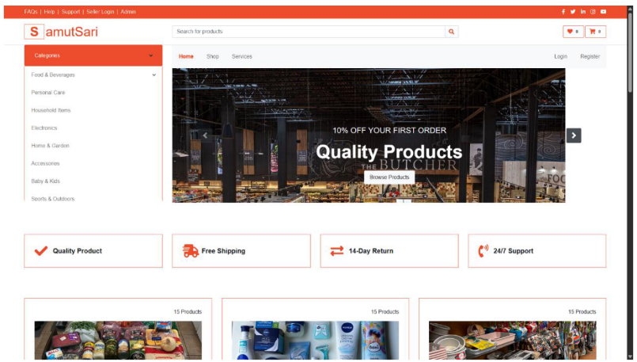
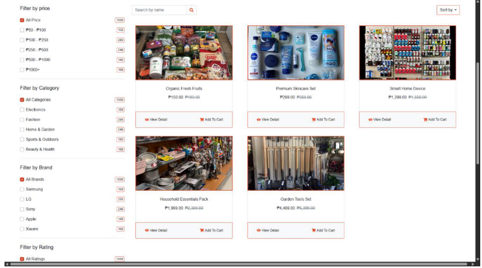

# SamutSari

_SamutSari_ is a web-application platform designed to serve as a marketplace where goods **and** services are offered — an “everything under one roof” kind of system.

## Table of Contents

- [About](#about)  
- [Features](#features)  
- [Technology Stack](#technology-stack)  
- [Objectives](#objectives)  
- [User Interface](#user-interface)

## About

This project provides a website that enables users to browse, list, buy, and/or hire a variety of offerings — whether physical goods or services. The concept is to streamline the discovery and transaction of diverse offerings in one place.

## Features

- User registration, login, and profile management  
- Listings of goods (items for sale) **and** services (tasks, gigs, etc.)  
- Search and categorization of listings  
- Viewing listing details including description, price/rate, and images  
- Ability to post a new listing (item or service)  
- Responsive UI and intuitive navigation  
- Admin/management functions (optional, depending on implementation)  

## Technology Stack

- **Frontend/Template**: EJS templates  
- **Backend**: JavaScript (Node.js / Express)  
- **Styling**: CSS (and any additional frameworks you may integrate)  
- **Database**: *TBD* (e.g., MongoDB, MySQL, DynamoDB)  
- **Deployment**: *TBD* (e.g., AWS, Z.com)  

## Objectives

### General Objective
The general objective of the team is to develop a community-based e-commerce web platform that connects local vendors, freelancers, and service providers with residents, while promoting secure transactions, affordable logistics, and inclusive digital participation.

### Specific Objectives
The specific objectives of the project are as follows:

1. To develop a user-friendly e-commerce website that functions smoothly on both desktop and mobile devices.  
2. To provide a central hub where vendors and service providers can showcase products, services, availability, and customer feedback.  
3. To integrate secure and convenient digital payment methods such as GCash, Maya, and Cash-on-Delivery.  
4. To introduce affordable and efficient logistics support, including subscription options for essentials and real-time tracking.  
5. To promote digital inclusion through basic training modules that enhance residents’ skills in online selling, customer service, and digital literacy.  

## User Interface

Below are sample UI interfaces from the SamutSari web application:

### Homepage (Guest)

The homepage displays product highlights, featured services, and quick access to categories.  
This page also allows the guests, sellers, and the admin to accesstheir respective login pages.

### Marketplace (Guest)

The marketplace allows users to browse available products and services.  
Users can filter by **price**, **category**, **brand**, or **rating**, and view product details or add items to their cart.

> _SamutSari – A Barangay Digital Marketplace and Skills Hub._
